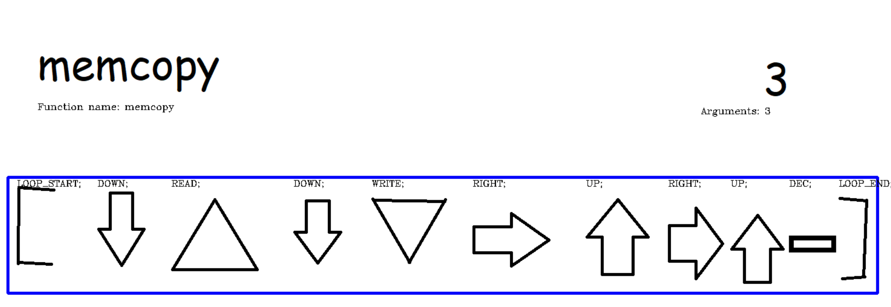
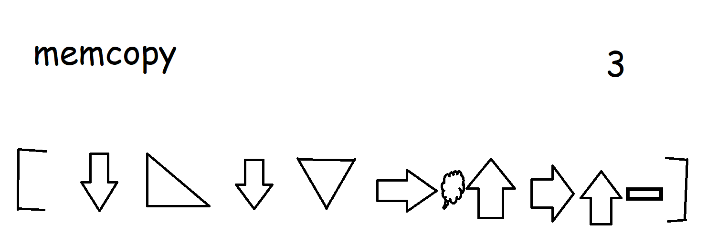
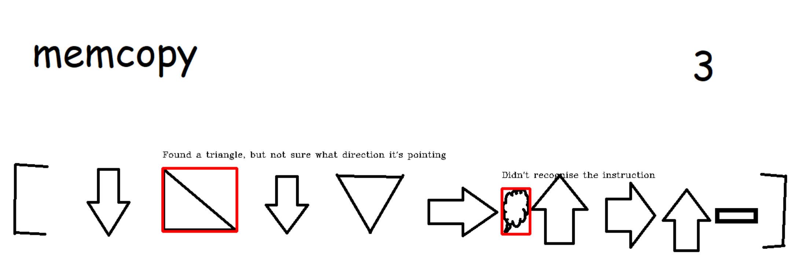

# vizh

An esoteric visual language that takes image files as input based on a multi-tape turing machine, designed for compatibility with C.

## Overview

Here is an implementation of `memcpy`:


Yes, you literally pass an image file to the compiler.

The "parser" is based on computer vision and the backend produces C code.

Here's how the parser understands the program (produced if you pass `--debug-parser` when compiling):



Here's a C program which calls into the function:

```c
#include <stdio.h>
// Supplied by linking with the vizh object file
void memcopy(uint8_t*,uint8_t*,uint8_t*);

int main() {
    uint8_t str[] = "Hello!";
    uint8_t size = sizeof(str);
    uint8_t to[sizeof(str)];

    memcopy(&size, str, to);
    puts(to);
}
```

We can compile this into an executable in a single command:

```console
$ vizh memcopy.png main_memcopy.c -o memcopy
```

Then run it:

```console
$ ./memcopy
Hello!
```

### Errors

But what if you make an error, like this?



Well you get the best compiler errors you'll ever see:



## Implementation

The provided implementation is called `vizh` and compiles to C and can link executables.

### Installation

You can install `vizh` directly from [PyPi](https://pypi.org/project/vizh/):

```console
$ pip install vizh
```

### Dependencies

`vizh` depends on [OpenCV](https://opencv.org/), [cffi](https://pypi.org/project/cffi/), and [Tesseract OCR](https://tesseract-ocr.github.io/tessdoc/Home.html).

You can install OpenCV and cffi with `pip`:

```console
$ pip install opencv-python cffi
```

You'll have to install Tesseract OCR separately. [See their documentation](https://tesseract-ocr.github.io/tessdoc/#tesseract-user-manual) for instructions.

### Usage

```
Usage: vizh [OPTIONS] [INPUTS]...

Options:
  --version               Show the version and exit.
  -c, --compile-only      Only compile, don't link.
  -o, --output-file PATH  Output file for executables or vizh object files.
  -q, --quiet             Suppress output.
  --debug-parser          Display how the parser understands your source file.
  --help                  Show this message and exit.
  ```

The compiler can take any combination of image files, C sources files, and object files.

You may need to set the `TESSDATA_PREFIX` environment variable to the folder containing Tesseract data. If you're on Linux this is likely `/usr/share/tesseract-ocr/<version>/tessdata`.

## Language

### Abstract Machine

The vizh abstract machine consists of:

- Some number of *tapes* which are contiguous groups of 8-bit unsigned integers
- A read/write head with storage for a single 8-bit unsigned integer

The initial state of the abstract machine is:

- A single tape of size 4096 is allocated with all cells initialised to 0
- The read/write head is initialised to the left-most cell of this tape

See [instructions](#instructions) for the valid operations on the abstract machine.

### Program

A vizh program consists of a number of functions, each in its own image file. (What image types are allowed? Ideally at least png and jpg)

The entry point to a vizh program is a function called `main`. (Note that the `main` function gets mangled as `vizh_main`. For all other functions the symbol name is the same as the vizh name).

### Functions

A vizh function is an image file containing:

- The name of the function at the top left of the image
- The number of arguments (tapes) it takes at the top right of the image
- A sequnce of instructions in a horizontal lines

Function names are alphanumeric: `[a-zA-Z][a-zA-Z0-9]*`.

The tapes available to a vizh function consist of its tape arguments. On entry to the function the r/w head is initialised to the start of the first tape argument, if any.

A function returns when control flow reaches the end of its instructions.

Any tapes allocated by a function are automatically deallocated when the function exits.

#### Function Calls

When you call a function subsequent pointer arguments are taken from the currently active tape onwards.

For example, given the following state of the abstract machine where `^` is the last position of the r/w head on that tape and `$` is the active tape:

```
 t1 01234
     ^
$t2 99999
    ^
 t3 00000
    ^
```

Then a call to a function that takes two tapes would supply the arguments `t2, t3`.

### Instructions

The valid instructions in vizh and their encodings are:

- Left arrow: move the r/w head left
- Right arrow: move the r/w head right
- Up arrow: move the r/w head to the tape above the current one
- Down arrow: move the r/w head to the tape below the current one
- Function name in a circle: call the given function
- +: increment the value pointed to by the r/w head by `1`
- -: decrement the value pointed to by the r/w head by `1`
- Equilateral triangle with the point at the top: read the cell pointed to by the r/w head into the r/w head storage
- Equilateral triangle with the point at the bottom: write the value stored in r/w head storage into the cell pointed to by the r/w head
- [&lt;instructions&gt;]: loop over the instructions between the brackets until the value pointed to by the r/w head at the start of the loop is `0` 

When you move the r/w head up or down, the position it was last at for the previous tape is saved. E.g. given this state of the abstract where `^` is the last position of the r/w head on that tape and `$` is the active tape:

```
$t0 01234
    ^  
 t1 01234
    ^
```

The sequence of instructions "right right right down" would result in this state:

```
 t0 01234
       ^  
$t1 01234
    ^
```

### Comments 

Comments in vizh are anything enclosed in a rectangle. Stick what you want in there.

## Standard Library

The vizh standard library is called `libv`. Much of it is implemented in vizh itself and it is built when you install `vizh`. It provides the following functions:

### I/O

- `readin`: read an ASCII character from stdin and write its integral representation into the cell pointed to by the r/w head
- `print`: print the value of the cell pointed to by the r/w head to stout, interpreted as an ASCII character
- `putstr`: write the null-terminated ASCII string starting at the position pointed to by the r/w head to stdout.

### Strings

- `geta`: puts the character `a` at the current position of the r/w head.
- `getA`: puts the character `A` at the current position of the r/w head.

### Arithmetic

- `add` given tape cells `a,b` from the r/w head, results in `a+b,0`.
- `mul` given tape cells `a,b,c` from the r/w head, results in `a*b,0,0`.
- `zero` given tape cell `a` from the r/w head, results in `0`

### Memory

- `newtape`: allocate a new secondary tape underneath the last one currently allocated for this function (or the primary tape if there are no secondary tapes)
- `freetape`: deallocate the bottom-most secondary tape for this function (no-op if there are not any)
