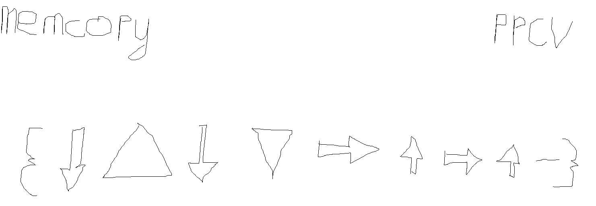

# vizh

An esoteric visual language based on a multi-tape turing machine.

## Language

### Abstract Machine

The vizh abstract machine consists of:

- A primary tape of 4096 8-bit unsigned integers
- Secondary tapes of 4096 8-bit unsigned integers which can be created and destroyed at runtime
- A read/write head with storage for a single 8-bit unsigned integer

The initial state of the abstract machine is:

- All primary tape cells are initialised to 0
- No secondary tapes are allocated
- The read/write head is initialised to the left-most cell of the primary tape

See [instructions](#instructions) for the valid operations on the abstract machine.

### Program

A vizh program consists of a number of functions, each in its own image file. (What image types are allowed? Ideally at least png and jpg)

The entry point to a vizh program is a function called `main`.

### Functions

A vizh function is an image file containing:

- The name of the function at the top left of the image
- A function signature at the top right of the image
- A sequnce of instructions in a horizontal line underneath these (can the instructions be split onto multiple lines? depends how easy that is to implement)

Function names are alphanumeric: `[a-zA-Z][a-zA-Z0-9]*`.

Function signatures are a sequence of parameter specifiers followed by a single return type specifier.

Valid parameter specifiers are:

- The capital letter `N` for number
- The capital letter `T` for tape

Valid return specifiers are:

- The capital letter `N` for number
- The capital letter `T` for tape
- The capital letter `V` for void (none)

Each vizh function has its own set of secondary tapes which initially consists of any tape arguments passed to it.

#### Function Calls

When you call a function, integer arguments are taken from subsequent positions from the r/w head's last position on the primary tape, and subsequent pointer arguments are taken from the currently active tape onwards.

For example, given the following state of the abstract machine where `^` is the last position of the r/w head on that tape and `$` is the active tape:

```
 t1 01234
     ^
$t2 99999
    ^
 t3 00000
    ^
```

Then a call to a function with the signature `ITIT` would supply the arguments `1, t2, 2, t3`.

#### Returning

If the function is specified to return a number, then the value at the r/w head is stored, the r/w head is moved to its last position on the primary tape, right one cell, and the stored value is written there.

If the function is specified to return a tape, then the currently-active tape is appended to the caller's secondary tapes if it wasn't already one of them.

Any tapes allocated by the callee and not returned are freed when the function exists.

### Instructions

The valid instructions in vizh and their encodings are:

- Left arrow: move the r/w head left
- Right arrow: move the r/w head right
- Up arrow: move the r/w head to the tape above the current one
- Down arrow: move the r/w head to the tape below the current one
- Function name in a circle: call the given function
- +: increment the value pointed to by the r/w head by `1`
- -: decrement the value pointed to by the r/w head by `1`
- Equilateral triangle with the point at the top: read the cell pointed to by the r/w head into the r/w head storage
- Equilateral triangle with the point at the bottom: write the value stored in r/w head storage into the cell pointed to by the r/w head
- {&lt;instructions&gt;}: loop over the instructions between the braces until the value pointed to by the r/w head at the start of the loop is `0` 

When you move the r/w head up or down, the position it was last at for the previous tape is saved. E.g. given this state of the abstract where `^` is the last position of the r/w head on that tape and `$` is the active tape:

```
$t0 01234
    ^  
 t1 01234
    ^
```

The sequence of instructions "right right right down" would result in this state:

```
 t0 01234
       ^  
$t1 01234
    ^
```

### Built-in Functions

Functions built-in to vizh are:

- `readin`: read an ASCII character from stdin and write its integral representation into the cell pointed to by the r/w head
- `print`: print the value of the cell pointed to by the r/w head to stout, interpreted as an ASCII character
- `newtape`: allocate a new secondary tape underneath the last one currently allocated for this function (or the primary tape if there are no secondary tapes)
- `freetape`: deallocate the bottom-most secondary tape for this function (no-op if there are not any)

### Examples

#### `memcopy`


